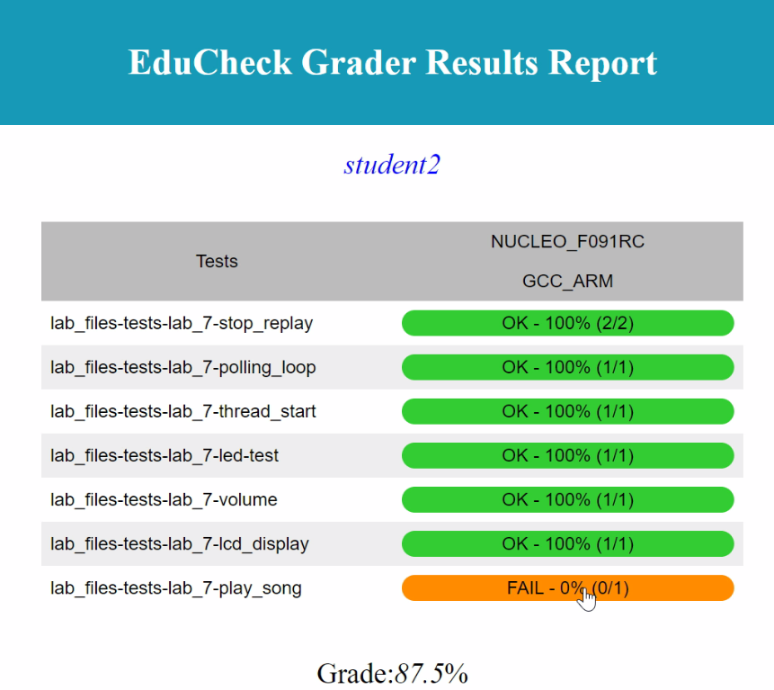

# EduCheck
Welcome to the EduCheck auto grader tool.
### [Download the tool here](https://github.com/arm-university/EduCheck/archive/refs/heads/main.zip)

EduCheck is an auto grading tool for coding exercises in the Rapid Embedded Education Kit. It does the following:
- Grades code functionality in the lab exercises supplied with the Arm Education Kit.
- Leverages on the Arm Mbed OS and Mbed Greentea to perform functional testing on submitted code, i.e., checks if the students' code will produce the expected outputs and runs the test on a physical Mbed-enabled board.
- Assumes that an incomplete skeleton code will be provided to the students who will fill in the blanks or build their code upon it.
- Does not assess code quality or plagiarism in submissions at the moment.
- Provides an HTML report for student code grades, for example: </br>
    

## Getting Involved
We welcome contributions, amendments & modifications to this education kit. For details, please click on the following links:

* [How to contribute](https://github.com/arm-university/EduCheck/blob/main/Contributions_and_Modifications/Contributions_and_Modifications.md)
* [Type of modifications](https://github.com/arm-university/EduCheck/blob/main/Contributions_and_Modifications/Desired_Contributions.md) we are looking for. We also use [Projects](https://github.com/arm-university/EduCheck/projects) to track progress.
* [Workflow](https://github.com/arm-university/Rapid-Embedded-Education-Kit/blob/main/Contributions_and_Modifications/workflow.pdf)

## License
You are free to amend, modify, fork or clone this material. See [License.md](https://github.com/arm-university/EduCheck/blob/main/LICENSE/License.md) for the complete license.

## Inclusive Language Commitment
Arm is committed to making the language we use inclusive, meaningful, and respectful. Our goal is to remove and replace non-inclusive language from our vocabulary to reflect our values and represent our global ecosystem.
 
Arm is working actively with our partners, standards bodies, and the wider ecosystem to adopt a consistent approach to the use of inclusive language and to eradicate and replace offensive terms. We recognise that this will take time. This course contains references to non-inclusive language; it will be updated with newer terms as those terms are agreed and ratified with the wider community. 
 
Contact us at education@arm.com with questions or comments about this tool. You can also report non-inclusive and offensive terminology usage in Arm content at terms@arm.com.

# Requirements
## Hardware requirements:
EduCheck requires the following hardware:
- An Arm Mbed-enabled board.

**Note: EduCheck currently will not work if you do not connect a Mbed-enabled board while running EduCheck. However you will not need any lab peripherals connected to the board itself.**

The following boards were tested with EduCheck:
- STMF746G-DISCO
- NUCLEO-F401RE
- NUCLEO-F091RC
- LPC-1768

## Software requirements
The EduCheck tool was tested in the following environment:
- Windows OS 10 (not WSL)
- mbed-cli 1.10.5 (Mbed Command Line Interface package)
- Mbed OS 6.5
- Mbed-Greentea 1.8.3
- Python 3.7.9
- pip 21.0.1
- Git 2.16.2.windows.1
- Mercurial 5.6.1
- GNU Compiler: GNU Arm Embedded Toolchain
(9_2020_q2_update)

**Note: See the [`Getting_Started.md`](codegrader/docs/Getting_Started.md) documentation for installation information.**

# Getting started
See the [`Getting_Started.md`](codegrader/docs/Getting_Started.md) documentation for installation information and how to
run EduCheck.

# Expected directory structure
**You must put unique student folders containing the code to be tested in the STUDENT_HOMEWORK folder. Each unique student folder should not have nested folders. A working example would be: *STUDENT_HOMEWORK/student1/mp3player.cpp*.** The EduCheck tool expects the following directory structure.
```
.
└── educheck
    ├── codegrader
    │   ├── README.md
    │   ├── docs/                       // Documentation Folder
    │   ├── STUDENT_HOMEWORK/           // Place unique student folders in here
    │   │   ├── student1
    │   │   │   └── mp3player.cpp
    │   │   ├── student2
    │   │   ├── student3
    │   │   ├── student4
    │   │   ├── student5
    │   │   └── test.cpp                // Educheck skips this test.cpp as it is
    |   |                                   not a unique folder
    |   |
    │   ├── codechecker/                // Educheck Source Code Package
    │   └── mbed_files/                 // Educheck pulls & builds Mbed OS in here
    ├── install.bat                     // Installation file for Educheck
```

See the [`Getting_Started.md`](codegrader/docs/Getting_Started.md) for more information.

# Known issues:
Please read the [`Troubleshooting_Guide.md`](codegrader/docs/Troubleshooting_Guide.md) for more information.
