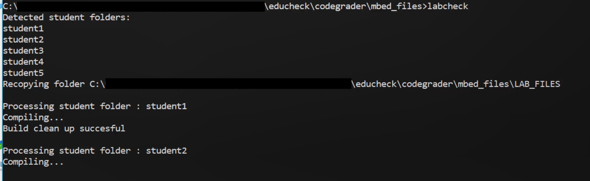
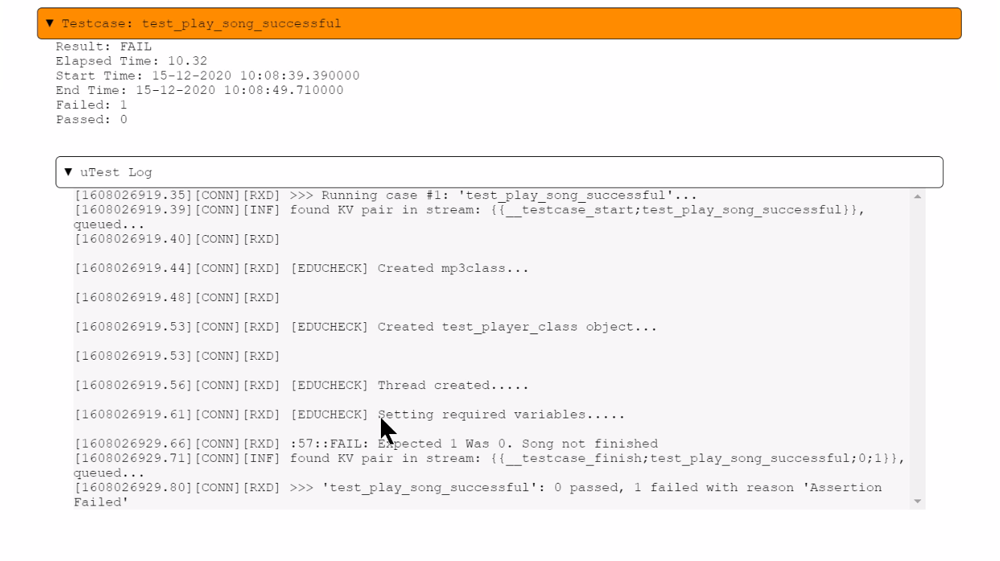

**This Getting Started guide is primarly based on Windows 10 OS. However, if you are using a MacOS or Linux, you can still follow these instructions but you must make your own command-line modifications to your corresponding OS.**

# Installing Prerequisites
### Python
1. Install the Python version listed in the [ReadMe](https://github.com/arm-university/EduCheck/blob/main/README.md#software-requirements) from https://www.python.org/
2. Add installation path to PATH:

    a. Click the Windows start button and type *Environment Variables*. Select *Edit the system environment variables*.

    b. Click on the *Environment Variables* button. Select *Path* in User Variables and click *Edit*.

    c. In the *Edit environment variable* click *New*, and enter the Python installation path in it. Then click *OK* on all windows.
3. Verify that the installation is successful by running the following command in your terminal:
    ```
    py --version
    ```
    *Might need to use 'python' or 'python3' instead of 'py' for this and following python commands.*

### Git
1. Install Git from https://git-scm.com/downloads.
2. Ensure you add the installation path in your environment variable PATH, similar to how it was done for the Python set up.
3. Verify that the installation is successful by running the following command in your terminal:
    ```
    git --version
    ```

### Mercurial
1. Install the Mercurial version listed in the [ReadMe](https://github.com/arm-university/EduCheck/blob/main/README.md#software-requirements) from https://www.mercurial-scm.org/wiki/Download.
For example, you can use pip:
    ```
    pip install Mercurial
    ```

2. Ensure you add the installation path in your environment variable PATH, similar to how it was done for the Python set up.
3. Verify that the installation is successful by running the following command in your terminal:
    ```
    hg --version
    ```

### Mbed-cli
1. Install mbed-cli using the following command:
    ```
    py -m pip install mbed-cli
    ```
2. Verify that the installation is successful by running the following command in your terminal:
    ```
    mbed-cli --version
    ```
### Mbed-Greentea
1. Install mbed-cli using the following command:
    ```
    py -m pip install mbed-greentea
    ```
2. Verify that the installation is successful by running the following command in your terminal:
    ```
    mbedgt --version
    ```

### Compiler
1. Install the GNU Arm Embedded Toolchain version listed in the [ReadMe](https://github.com/arm-university/EduCheck/blob/main/README.md#software-requirements) from [Arm Developer](https://developer.arm.com/tools-and-software/open-source-software/developer-tools/gnu-toolchain/gnu-rm)
2. Ensure you add the installation path (`<installationpath\GNU Arm Embedded Toolchain\9 2020-q2-update\bin>`) in your environment variable PATH, similar to how it was done for the Python set up.
3. Verify that the installation is successful by running the following command in your terminal:
    ```
    arm-none-eabi-g++ --version
    ```
4. Set the path of the installed compiler using the following command. For example:
    ```
    mbed config -G GCC_ARM_PATH "C:\Program Files (x86)\GNU Arm Embedded Toolchain\9 2020-q2-update\bin"
    ```

# Installing Educheck
1. Change directory to the `educheck` folder:
    ```
    cd educheck
    ```
2. Run the `install.bat` file:
    ```
    install.bat
    ```
    The `install.bat` file will start pulling the latest Arm Mbed OS into the [`educheck\codegrader\mbed_files`](../mbed_files) folder.
    Installing Mbed OS might take some time for the first time.
3. Install the `codechecker` package in coderader folder:
    ```
    cd codegrader
    py -m pip install codechecker/
    ```
    The `codechecker` package contains:
    - `LAB_FILES` folder: All supporting code for labs and educheck Greentea tests to grade submitted code functionality.
    - `LAB_SOLUTION` folder: Code solution (for lecturer's reference).
    - `labcheck` folder: Educheck Python CLI scripts that run the grading.
    - and other files such as [`setup.py`](https://github.com/arm-university/EduCheck/blob/main/codegrader/codechecker/setup.py) and [`requirements.txt`](https://github.com/arm-university/EduCheck/blob/main/codegrader/codechecker/requirements.txt)

# Running Educheck tool
The Educheck Git Repo provides a series of Greentea tests written specifically to test code functionality for the final lab exercise in the Rapid Embedded Education Kit. The Greentea tests provided target specific lab code exercise features such as polling loop, LCD display, etc...

To run the Educheck tool for the final lab exercise of the Rapid Embedded Education Kit, follow these steps:

1. Place all **student folders** containing the submitted code in `educheck\codegrader\STUDENT_HOMEWORK\`.
    **Note: You must put unique student folders containing the code to be tested in the STUDENT_HOMEWORK folder. Each unique student folder should not have nested folders. A working example would be: *STUDENT_HOMEWORK/student1/mp3player.cpp*.** Currently the folder already contains example studnet submissions.
2. Ensure that you do not have Mbed Studio open. This may interfere with the COM port permission.
3. Connect your PC to an Mbed-enabled board.
4. Run the `mbedls` command to ensure that your board has been detected. For example:
    ```
    C:\> mbedls
    | platform_name | platform_name_unique | mount_point | serial_port |
    target_id                | interface_version |
    |---------------|----------------------|-------------|-------------|
    -------------------------|-------------------|
    | NUCLEO_F401RE | NUCLEO_F401RE[0]     | E:          | COM23       | 07200221033865763C7CF36B | 0221              |
    ```
5. Change directory to `mbed_files`:
    ```
    cd educheck\codegrader\mbed_files
    ```
6. Run the `labcheck` command to invoke Educheck's command-line interface: <br />
    


    - The `labcheck` command will initially detect all the student folders inside `STUDENT_HOMEWORK`. It will then:
        - copy all the `LAB_FILES` from `labcheck` folder
        - iteratively compile the main code for each student
            - run the Greentea tests
            - store the test results in the `GRADE_RESULTS` directory under the appropriate student folder
            - clean up any build files of that particular student and then moves on to the next student
    - HTML-based results along with any compile or runtime error logs are stored in `GRADE_RESULTS` directory under the appropriate student folder. You can also click on the results to see the test log messages. For example: <br />
     
     

# Educheck command-line arguments
To check all available arguments for Educheck tool, run: 
```
C:\>labcheck -h

usage: labcheck [-h] [--board BOARD] [--result RESULT]
                [--grade GRADE [GRADE ...]] [--requirements]

EduCheck Interface

optional arguments:
  -h, --help            show this help message and exit
  --board BOARD, -b BOARD
                        Enter the development board used for the test
  --result RESULT, -res RESULT
                        Output file format
  --grade GRADE [GRADE ...], -g GRADE [GRADE ...]
                        List students to grade. Default, all students will be
                        graded or list select student using format <student1,
                        student2, ...>
  --requirements, -req  Check mbed version, GCC_ARM and connected board
```

# Known issues
See [`Troubleshooting_Guide.md`](./Troubleshooting_Guide.md) for more information.

# FAQs
## How does Educheck work?
Educheck contains a group of Mbed Greentea tests that were written specifically for the lab exercises. These tests run against the code submitted and use Unity test framework to assert whether the code or function written produced the expected outcome. Python scripts are then wrapped around these tests to provide a command-line interface where the automation of compiling for each student folder with the Greentea tests and grade report generation is done.

Note that Educheck assumes a specific code structure in order for the tests to run. Therefore it is working under the assumption that students will be provided a skeleton code where they will complete missing bits of the code.


## How do I create my own Greentea tests?
You can start by looking at the Educheck's Greentea tests in `educheck/codegrader/codechecker/LAB_FILES/TESTS` as a reference. These Greentea tests provided are targetting specific features of the final lab in the Rapid Embedded Education Kit, such as polling loop, LCD display, stop and replay button etc.

 If you would like the `labcheck` CLI to run your tests, please place your test in  `educheck/codegrader/codechecker/LAB_FILES/TESTS` and follow the same directory structure. Mbed Greentea discovers tests in folders marked `TESTS`. For more information on Greentea, see https://os.mbed.com/docs/mbed-os/v6.6/debug-test/greentea-for-testing-applications.html

 If you would like to create your own Greentea tests for different lab exercises (not final lab of Rapid Embedded Education Kit), then you might need to include any supporting C++ files in `educheck/codegrader/codechecker/LAB_FILES/`. You may need to modify the labcheck Python scripts to ensure that it includes the right files for compilation.

 Please contact Arm Education rsh-edu-eng@arm.com for more information.

## What if I don't use Mbed in my code?
Educheck uses Mbed tools and Mbed Greentea and thus Educheck will not work on any code that does not use Mbed.
